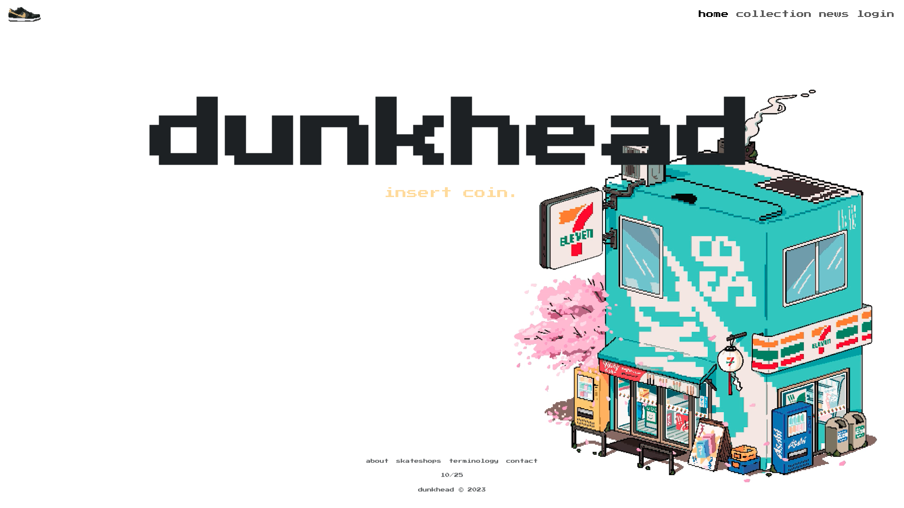

<!-- PROJECT LOGO -->
<div align="center">
  <a href="https://dunkhead-f335b4ce798d.herokuapp.com/">
    
  </a>

  <h3 align="center" style="font-size: 2.1em; font-weight: bolder;">dunkhead</h3>

  <p align="center">
    A website that collects and displays information about Nike Dunk SB sneakers.
    <br />
    <a href="https://github.com/nestrada2/dunkhead"><strong>Explore the docs »</strong></a>
    <br />
    <br />
    <a href="https://dunkhead-f335b4ce798d.herokuapp.com/">View Demo</a>
    ·
    <a href="https://github.com/nestrada2/dunkhead/issues/new?labels=bug&template=bug_report.md">Report Bug</a>
    ·
    <a href="https://github.com/nestrada2/dunkhead/issues/new?labels=enhancement&template=feature_request.md">Request Feature</a>
  </p>
</div>

<!-- TABLE OF CONTENTS -->
<details>
  <summary>Table of Contents</summary>
  <ol>
    <li>
      <a href="#about-the-project">About The Project</a>
      <ul>
        <li><a href="#tech-stack">Tech Stack</a></li>
      </ul>
    </li>
    <li>
      <a href="#getting-started">Getting Started</a>
      <ul>
        <li><a href="#installation">Installation</a></li>
        <li><a href="#run-the-program">Run the Program</a></li>
      </ul>
    </li>
    <li><a href="#license">License</a></li>
    <li><a href="#resources">Resources</a></li>
  </ol>
</details>

<!-- ABOUT THE PROJECT -->
## 📖 About the Project



This program aims to create a unique website for sneaker enthusiasts, focusing specifically on the history, news, and cultural significance of Nike Dunk SBs. While many sneaker websites follow a similar format to cover sneaker culture, this app offers a more personal and creative perspective. It emphasizes the artistic and cultural value of sneakers, particularly Dunk SBs, over their commercial appeal.

### **🛠️ Tech Stack**

|                    Front-End                    |                 Template Engine                 |                   Back-End                   |
| :---------------------------------------------: | :---------------------------------------------: | :------------------------------------------: |
|       [![JQuery][JQuery.com]][JQuery-url]       | [![Handlebars][Handlebars.com]][Handlebars-url] |    [![Node.js][Node.js.com]][Node.js-url]    |
|          [![AJAX][AJAX.com]][AJAX-url]          |                                                 |    [![Express][Express.com]][Express-url]    |
|  [![Bootstrap][Bootstrap.com]][Bootstrap-url]   |                                                 |    [![Mongodb][Mongodb.com]][Mongodb-url]    |
|       [![Nescss][Nescss.com]][Nescss-url]       |                                                 | [![SneaksAPI][SneaksAPI.com]][SneaksAPI-url] |
| [![Animatecss][Animatecss.com]][Animatecss-url] |                                                 | [![Puppeteer][Puppeteer.com]][Puppeteer-url] |
|                                                 |                                                 |        [![GSAP][GSAP.com]][GSAP-url]         |
|                                                 |                                                 |  [![MomentJS][MomentJS.com]][MomentJS-url]   |

<!-- GETTING STARTED -->
## 📦 Getting Started

### **💾 Installation**
1. Clone the repo
   ```sh
   git clone https://github.com/nestrada2/dunkhead.git
   ```
2. Install NPM packages
   ```sh
   npm install
   ```

### **▶️ Running the Program**
```
node server.js
```

<!-- LICENSE -->
## 📜 License
Distributed under the MIT License. See [`LICENSE.txt`](LICENSE.txt) for more information.

<!-- RESOURCES -->
## 📚 Resources
[Express](https://expressjs.com/),
[Stack Overflow](https://stackoverflow.com/),
[W3 School](https://www.w3schools.com/),
[MDN](https://developer.mozilla.org/en-US/),
[Geeks for Geeks](https://www.geeksforgeeks.org/),
[CSS Tricks](https://css-tricks.com/snippets/css/a-guide-to-flexbox/),
[jQuery](https://jquery.com/),
[AJAX](https://api.jquery.com/Jquery.ajax/),
[Bootstrap](https://getbootstrap.com/),
[NES.css](https://nostalgic-css.github.io/NES.css/),
[Animate.css](https://animate.style/),
[Handlebars](https://handlebarsjs.com/),
[Sneaks API](https://github.com/druv5319/Sneaks-API),
[Moment.js](https://momentjs.com/),
[Puppeteer](https://pptr.dev/),
[GSAP](https://gsap.com/),
[Nice Kicks](https://www.nicekicks.com/nike-sb-dunk-history/),
[Kicks on Fire](https://www.kicksonfire.com/tag/nike-sb-dunk),
[Sneaker Freaker](https://www.sneakerfreaker.com/features/a-complete-retrospective-of-nike-sb-boxes-and-eras/),
[Adobe Illustrator](https://www.adobe.com/products/illustrator/campaign/pricing.html?sdid=91BF4QJB&mv=search&mv2=paidsearch&ef_id=4dd8a4a3a4ab1764f566c3bff7b05080:G:s&s_kwcid=AL!3085!10!79646056249241!20541717517),
[Adobe Premiere Pro](https://www.adobe.com/products/premiere/campaign/pricing.html?sdid=4JW796YG&mv=search&mv2=paidsearch&ef_id=a43771e8c0eb1508165016f4938b3c7c:G:s&s_kwcid=AL!3085!10!78752726571545!78752917250528)

<!------- MARKDOWN LINKS & IMAGES ------->
[Button Click]: https://img.shields.io/badge/Click_Me!-37a779?style=for-the-badge
[JQuery.com]: https://img.shields.io/badge/jQuery-0769AD?style=for-the-badge&logo=jquery&logoColor=white
[JQuery-url]: https://jquery.com
[AJAX.com]: https://img.shields.io/badge/AJAX-003C30?style=for-the-badge&logo=xml
[AJAX-url]: https://api.jquery.com/Jquery.ajax/
[Handlebars.com]: https://img.shields.io/badge/Handlebars-FC8019?style=for-the-badge&logo=handlebars
[Handlebars-url]: https://handlebarsjs.com/
[Node.js.com]: https://img.shields.io/badge/Node.js-43853D?style=for-the-badge&logo=node.js&logoColor=white
[Node.js-url]: https://nodejs.org/en
[Bootstrap.com]: https://img.shields.io/badge/Bootstrap-563D7C?style=for-the-badge&logo=bootstrap&logoColor=white
[Bootstrap-url]: https://getbootstrap.com/
[Express.com]: https://img.shields.io/badge/Express.js-404D59?style=for-the-badge
[Express-url]: https://expressjs.com/
[Nescss.com]: https://img.shields.io/badge/NES.css-100000?style=for-the-badge&logo=nes
[Nescss-url]: https://nostalgic-css.github.io/NES.css/
[Mongodb.com]: https://img.shields.io/badge/MongoDB-4EA94B?style=for-the-badge&logo=mongodb&logoColor=white
[Mongodb-url]: https://www.mongodb.com/
[Animatecss.com]: https://img.shields.io/badge/Animate.css-430098?style=for-the-badge&logo=Animatecss
[Animatecss-url]: https://animate.style/
[SneaksAPI.com]: https://img.shields.io/badge/Sneaks%20API-30363D?style=for-the-badge&logo=SneaksAPI
[SneaksAPI-url]: https://github.com/druv5319/Sneaks-API
[Puppeteer.com]: https://img.shields.io/badge/Puppeteer-21C25E?style=for-the-badge&logo=Puppeteer
[Puppeteer-url]: https://pptr.dev/
[GSAP.com]: https://img.shields.io/badge/GSAP-000000?style=for-the-badge&logo=GSAP
[GSAP-url]: https://gsap.com/
[MomentJS.com]: https://img.shields.io/badge/Moment.js-00C7B7?style=for-the-badge&logo=MomentJS
[MomentJS-url]: https://momentjs.com/
